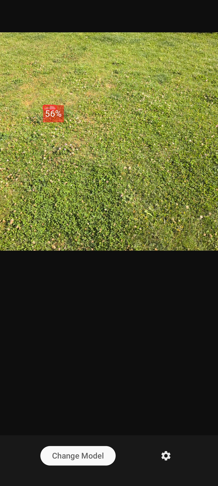
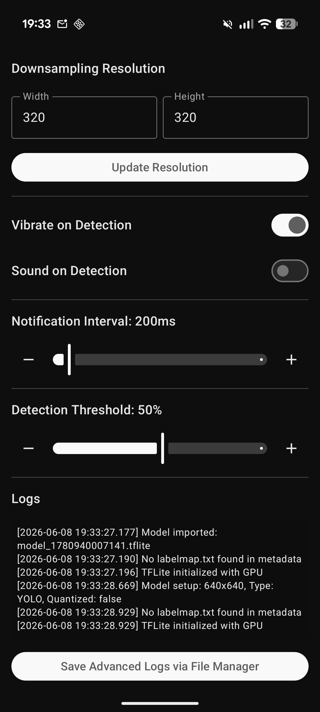

# PFM-1 Detector App
This is an app, that imports a .tflite model and uses it for live object detection - in this case the PFM-1 antipersonnel mine. 

The main view includes:
- live camera image
- object bounding box and detection certainty
- bottom bar with buttons for importing a .tflite model and settings

The settings view includes:
- basic logs
- vibration toggle
- sound toggle
- detection threshold slider
- button for saving logs to device storage as text file
- two number input fields for specifying downsampling resolution, pre-filled with 320x320

Both the model importing and logs saving utilize the system file manager.  
On successful object detection, the smartphone vibrates and/or makes a sound.

### Screenshots
 
